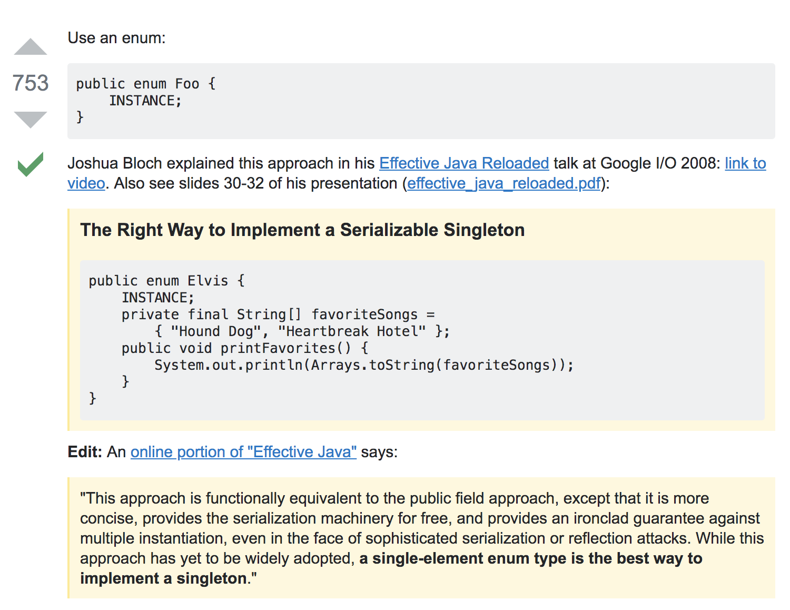

# 枚举
## 目录
* [1背景](###1背景)
* [2定义](###2定义)
* [3特点](###3特点)
* [4应用场景](###4应用场景)
* [5总结](###5总结)
* [6用法](###6用法)
* [7枚举的实现](###7枚举的实现)
* [8枚举与单例enum类](###8枚举与单例enum类)
* [9java枚举如何比较](###9java枚举如何比较)
* [10switch对枚举的支持](###10switch对枚举的支持)
* [11枚举的序列化如何实现](###11枚举的序列化如何实现)


### 1背景
在java语言中还没有引入枚举类型之前，表示枚举类型的常用模式是声明一组具有int常量。之前我们通常利用public final  static  方法定义的代码如下，分别用1表示春天，2表示夏天，3表示秋天，4表示冬天。
```java
public  class   Season{
    public static  final  int  SPRING = 1;
    public static  final  int  SUMMER = 2;
    public static  final  int  AUTUMN = 3;
    public static  final  int  WINTER = 4;
}
```
这种方法称作int枚举模式。可	这种模式有什么问题呢，我们都用了那么久了，应该没问题的。
通常我们写出来的代码都会考虑它的安全性、易用性、和可读性。
首先我们来考虑一下它的类型安全性。当然这种模式不是类型安全的。
比如说我们设计一个函数，要求传入春夏秋冬的某个值。但是使用int类型，我们无法保证传入的值为合法。代码如下所示：
```java
public  class   Season{
    public static  final  int  SPRING = 1;
    public static  final  int  SUMMER = 2;
    public static  final  int  AUTUMN = 3;
    public static  final  int  WINTER = 4;
}
public class client{
    private String getChineseSeason(int season){
        StringBuffer result = new StringBuffer();
        switch(season){
            case Season.SPRING :
                result.append("春天");
                break;
            case Season.SUMMER :
                result.append("夏天");
                break;
            case Season.AUTUMN :
                result.append("秋天");
                break;
            case Season.WINTER :
                result.append("冬天");
                break;
            default :
                result.append("地球没有的季节");
                break;
        }
        return result.toString();
    }

    public void doSomething(){
        System.out.println(this.getChineseSeason(Season.SPRING));//这是正常的场景

        System.out.println(this.getChineseSeason(5));//这个却是不正常的场景，这就导致了类型不安全问题
    }
}

```
程序getChineseSeason(Season.SPRING)是我们预期的使用方法。可getChineseSeason(5)显然就不是了，而且编译很通过，在运行时会出现什么情况，我们就不得而知了。这显然就不符合Java程序的类型安全。

接下来我们来考虑一下这种模式的可读性。
使用枚举的大多数场合，我都需要方便得到枚举类型的字符串表达式。
如果将int枚举常量打印出来，我们所见到的就是一组数字，这是没什么太大的用处。
我们可能会想到使用String常量代替int常量。虽然它为这些常量提供了可打印的字符串，但是它会导致性能问题，
因为它依赖于字符串的比较操作，所以这种模式也是我们不期望的。 从类型安全性和程序可读性两方面考虑，
int和String枚举模式的缺点就显露出来了。幸运的是，从Java1.5发行版本开始，
就提出了另一种可以替代的解决方案，可以避免int和String枚举模式的缺点，并提供了许多额外的好处。
那就是枚举类型（enum type）。接下来的章节将介绍枚举类型的定义、特征、应用场景和优缺点。
### 2定义
枚举类型（enum type）是指由一组固定的常量组成合法的类型。Java中由关键字enum来定义一个枚举类型。下面就是java枚举类型的定义。
```java
public enum Season {
    SPRING, SUMMER, AUTUMN, WINER;
}
```
### 3特点
Java定义枚举类型的语句很简约。它有以下特点：
> 1、用关键字enum 2) 类型名称，比如这里的Season 3) 一串允许的值，比如上面定义的春夏秋冬四季 4) 枚举可以单独定义在一个文件中，也可以嵌在其它Java类中

除了这样的基本要求外，用户还有一些其他选择

>5枚举可以实现一个或多个接口（Interface） 6) 可以定义新的变量 7) 可以定义新的方法8) 可以定义根据具体枚举值而相异的类
### 4应用场景
以在背景中提到的类型安全为例，用枚举类型重写那段代码。代码如下：
```
public enum Season {
    SPRING(1), SUMMER(2), AUTUMN(3), WINTER(4);

    private int code;
    private Season(int code){
        this.code = code;
    }

    public int getCode(){
        return code;
    }
}
public class UseSeason {
    /**
     * 将英文的季节转换成中文季节
     * @param season
     * @return
     */
    public String getChineseSeason(Season season){
        StringBuffer result = new StringBuffer();
        switch(season){
            case SPRING :
                result.append("[中文：春天，枚举常量:" + season.name() + "，数据:" + season.getCode() + "]");
                break;
            case AUTUMN :
                result.append("[中文：秋天，枚举常量:" + season.name() + "，数据:" + season.getCode() + "]");
                break;
            case SUMMER : 
                result.append("[中文：夏天，枚举常量:" + season.name() + "，数据:" + season.getCode() + "]");
                break;
            case WINTER :
                result.append("[中文：冬天，枚举常量:" + season.name() + "，数据:" + season.getCode() + "]");
                break;
            default :
                result.append("地球没有的季节 " + season.name());
                break;
        }
        return result.toString();
    }

    public void doSomething(){
        for(Season s : Season.values()){
            System.out.println(getChineseSeason(s));//这是正常的场景
        }
        //System.out.println(getChineseSeason(5));
        //此处已经是编译不通过了，这就保证了类型安全
    }

    public static void main(String[] arg){
        UseSeason useSeason = new UseSeason();
        useSeason.doSomething();
    }
}
```
[中文：春天，枚举常量:SPRING，数据:1] [中文：夏天，枚举常量:SUMMER，数据:2] [中文：秋天，枚举常量:AUTUMN，数据:3] [中文：冬天，枚举常量:WINTER，数据:4]

这里有一个问题，为什么我要将域添加到枚举类型中呢？目的是想将数据与它的常量关联起来。如1代表春天，2代表夏天。
### 5总结
那么什么时候应该使用枚举呢？每当需要一组固定的常量的时候，如一周的天数、一年四季等。或者是在我们编译前就知道其包含的所有值的集合。Java 1.5的枚举能满足绝大部分程序员的要求的，它的简明，易用的特点是很突出的。
### 6用法
#### 用法一：常量
```
public enum Color {  
  RED, GREEN, BLANK, YELLOW  
}  
```
#### 用法二：switch
```
enum Signal {  
    GREEN, YELLOW, RED  
}  
public class TrafficLight {  
    Signal color = Signal.RED;  
    public void change() {  
        switch (color) {  
        case RED:  
            color = Signal.GREEN;  
            break;  
        case YELLOW:  
            color = Signal.RED;  
            break;  
        case GREEN:  
            color = Signal.YELLOW;  
            break;  
        }  
    }  
}  

```
#### 用法三：向枚举中添加新方法
```
public enum Color {  
    RED("红色", 1), GREEN("绿色", 2), BLANK("白色", 3), YELLO("黄色", 4);  
    // 成员变量  
    private String name;  
    private int index;  
    // 构造方法  
    private Color(String name, int index) {  
        this.name = name;  
        this.index = index;  
    }  
    // 普通方法  
    public static String getName(int index) {  
        for (Color c : Color.values()) {  
            if (c.getIndex() == index) {  
                return c.name;  
            }  
        }  
        return null;  
    }  
    // get set 方法  
    public String getName() {  
        return name;  
    }  
    public void setName(String name) {  
        this.name = name;  
    }  
    public int getIndex() {  
        return index;  
    }  
    public void setIndex(int index) {  
        this.index = index;  
    }  
}  
```
#### 用法四：覆盖枚举的方法
```
public enum Color {  
    RED("红色", 1), GREEN("绿色", 2), BLANK("白色", 3), YELLO("黄色", 4);  
    // 成员变量  
    private String name;  
    private int index;  
    // 构造方法  
    private Color(String name, int index) {  
        this.name = name;  
        this.index = index;  
    }  
    //覆盖方法  
    @Override  
    public String toString() {  
        return this.index+"_"+this.name;  
    }  
}  
```
#### 用法五：实现接口
```
public interface Behaviour {  
    void print();  
    String getInfo();  
}  
public enum Color implements Behaviour{  
    RED("红色", 1), GREEN("绿色", 2), BLANK("白色", 3), YELLO("黄色", 4);  
    // 成员变量  
    private String name;  
    private int index;  
    // 构造方法  
    private Color(String name, int index) {  
        this.name = name;  
        this.index = index;  
    }  
//接口方法  
    @Override  
    public String getInfo() {  
        return this.name;  
    }  
    //接口方法  
    @Override  
    public void print() {  
        System.out.println(this.index+":"+this.name);  
    }  
}  
```
#### 用法六：使用接口组织枚举
```
public interface Food {  
    enum Coffee implements Food{  
        BLACK_COFFEE,DECAF_COFFEE,LATTE,CAPPUCCINO  
    }  
    enum Dessert implements Food{  
        FRUIT, CAKE, GELATO  
    }  
}
```
### 7枚举的实现
Java SE5提供了一种新的类型-Java的枚举类型，关键字enum可以将一组具名的值的有限集合创建为一种新的类型，而这些具名的值可以作为常规的程序组件使用，这是一种非常有用的功能。

要想看源码，首先得有一个类吧，那么枚举类型到底是什么类呢？是enum吗？答案很明显不是，enum就和class一样，只是一个关键字，他并不是一个类，那么枚举是由什么类维护的呢，我们简单的写一个枚举：
```
public enum t {
    SPRING,SUMMER;
}
```
然后我们使用反编译，看看这段代码到底是怎么实现的，反编译后代码内容如下：
```
public final class T extends Enum
{
    private T(String s, int i)
    {
        super(s, i);
    }
    public static T[] values()
    {
        T at[];
        int i;
        T at1[];
        System.arraycopy(at = ENUM$VALUES, 0, at1 = new T[i = at.length], 0, i);
        return at1;
    }

    public static T valueOf(String s)
    {
        return (T)Enum.valueOf(demo/T, s);
    }

    public static final T SPRING;
    public static final T SUMMER;
    private static final T ENUM$VALUES[];
    static
    {
        SPRING = new T("SPRING", 0);
        SUMMER = new T("SUMMER", 1);
        ENUM$VALUES = (new T[] {
            SPRING, SUMMER
        });
    }
}
```
通过反编译后代码我们可以看到，public final class T extends Enum，说明，该类是继承了Enum类的，同时final关键字告诉我们，这个类也是不能被继承的。

当我们使用enmu来定义一个枚举类型的时候，编译器会自动帮我们创建一个final类型的类继承Enum类，
所以枚举类型不能被继承。
### 8枚举与单例enum类
关于单例模式，Hollis的博客中有很多文章介绍过。作为23种设计模式中最为常见的设计模式，单例模式并没有想象的那么简单

因为在设计单例的时候要考虑很多问题，比如线程安全问题、序列化对单例的破坏等。

单例相关文章一览：

[设计模式（二）---单例模式](http://www.hollischuang.com/archives/1373)
[-----JDK中的那些单例](http://www.hollischuang.com/archives/1383)
[单例模式的七种写法](http://www.hollischuang.com/archives/205)
[单例与序列化的那些事儿](http://www.hollischuang.com/archives/1144)
[不使用synchronized和lock,如何实现一个线程安全的单例？](http://www.hollischuang.com/archives/1860)

如果你对单例不是很了解，或者对于单例的线程安全问题以及序列化会破坏单例等问题不是很清楚，
可以先阅读以上文章。上面六篇文章看完之后，相信你一定会对单例模式有更多，更深入的理解。

我们知道，单例模式，一般有七种写法，那么这七种写法中，最好的是哪一种呢？为什么呢？本文就来抽丝剥茧
一下。

#### 哪种写单例的方式最好
在StackOverflow中，有一个关于
[What is an efficient way to implement a singleton pattern in Java?](https://stackoverflow.com/questions/70689/what-is-an-efficient-way-to-implement-a-singleton-pattern-in-java)
的讨论：


如上图，得票率最高的回答是：使用枚举。

回答者引用了Joshua Bloch大神在《Effective Java》中明确表达的观点：
>使用枚举实现单例的方法虽然还没有广泛采用，但是单元素的枚举类型已经成为实现Singleton的最佳方法。

如果你真的深入理解了单例的用法以及一些可能存在的坑的话，那么你也许也能得到相同的结论，那就是：使用枚举实现
单例是一种很好的方法。

####枚举单例写法简单
如果你看过《[例模式的七种写法](http://www.hollischuang.com/archives/205)》中的实现单例的所有方式的代码
，那就会发现，各种方式实现单例的代码都比较复杂。主要原因是在考虑线程安全问题。

我们简单对比下“双重校验锁”方式和枚举方式实现单例的代码。

"双重校验锁"实现单例：
```java
public class Singleton{
    private volatile static Singleton singleton;
    private Singleton(){}
    public static Singleton getSingleton(){
        if(singleton == null)
        {
            synchronized (Singleton.class)
            {
                if(singleton == null)
                {
                    singleton = new Singleton();
                }
            }
        }
        return singleton;
    }
}
```
枚举实现单例：
```java
public enum  Singleton{
    INSTANCE;
    public void whateverMethod(){
    }
}

```
相比之下，你就会发现，枚举实现单例的代码会精简很多。

上面的双重锁校验的代码之所以很臃肿，是因为大部分代码都是在保证线程安全。为了在保证线程安全和锁粒度之间做
权衡，代码难免会写的复杂些。但是，这段代码还是有问题的。因为他无法解决反序列化会破坏单例的问题。

#### 枚举可解决线程安全问题
上面提到过。使用非枚举的方式实现单例，都要自己来保证线程安全，所以这就导致其他方法必然是比较臃肿的。那么，
为什么使用枚举就不需要解决线程安全问题呢？

其实，并不是使用枚举就不需要保证线程安全，只不过线程安全的保证不需要我们关心而已。也就是说，其实在“底层”
还是做了线程安全方面的保证的。

那么，“底层”到底指的是什么？

这就要说到关于枚举的实现了。这部分内容可以参考Hollis的另外一篇博文
[深度分析Java的枚举类型---枚举的线程安全性及序列化问题](http://www.hollischuang.com/archives/197)
,这里我简单说明一下：

定义枚举时使用enum和class一样，是Java中的一个关键字。就像class对应一个Class类一样，enum也对应有一个
Enum类。

通过定义好的枚举反编译，我们就能发现，其实枚举在经过`javac`的编译之后，会被转换成形如`public final class
 T extends Enum`的定义。
 
 而且，枚举中的各个枚举项同时通过`static`来定义的。如
 ```java
public enum T {
    SPRING,SUMMER,AUTUMN,WINTER
}
```
反编译后代码为：
```java
public final class T extends Enum{
    //省略部分内容
    public static final T SPRING;
    public static final T SUMMER;
    public static final T AUTUMN;
    public static final T WINTER;
    private static final T ENUM$VALUES[];
    
    static{
        SPRING = new T("SPRING",0);
        SUMMER = new T("SUMMER",0);
        AUTUMN = new T("AUTUMN",0);
        WINTER = new T("WINTER",0);
        ENUM$VALUES = (new T[]{
            SPRING,SUMMER,AUTUMN,WINTER    
        });

    }
}
```
了解JVM的类加载机制的朋友 应该对这部分比较清楚。`static`类型的属性会在类被加载之后被初始化，我们在
[深度分析Java的ClassLoader机制（源码级别）](http://www.hollischuang.com/archives/199)
和[Java类的加载、链接和初始化](http://www.hollischuang.com/archives/201)
两个文章中分别介绍过，当一个Java类第一次被真正使用到的时候静态资源被初始化、Java类的加载和初始化过程都
是线程安全的（因为虚拟机在加载枚举的类的时候，会使用ClassLoader的loadClass方法，而这个方法使用同步代码
块保证了线程安全）。所以，创建一个enum类型是线程安全的。

也就是说，我们定义的一个枚举，在第一次被真正用到的时候，会被虚拟机加载并初始化，而这个初始化过程是线程
安全的。而我们知道，解决单例的并发问题，主要解决的就是初始化过程中的线程安全问题。

所以，由于枚举的以上特性，枚举实现的单例是天生线程安全的。

#### 枚举可解决反序列化会破坏单例的问题
前面我们提到过，就是使用双重校验锁实现的单例存在一定问题的，就是这种单例有可能被序列化锁破坏，关于这种破坏及
解决办法，参看[单例与序列化的那些事儿](http://www.hollischuang.com/archives/1144)
,这里不做更加详细的说明了。

那么，对于序列化这件事情，为什么枚举又有先天的优势了呢？答案可以在
[Java Object Serialization Specification](https://docs.oracle.com/javase/7/docs/platform/serialization/spec/serial-arch.html#6469)
中找到答案。其中专门对枚举的序列化做了如下规定：

serialization

大概意思就是：在序列化的时候Java仅仅是将枚举对象的name属性输出到结果中，反序列化的时候则是通过
`java.lang.Enum`的`valueOf`方法来根据名字查找枚举对象。同时，编译器是不允许任何对这种序列化机制的定制
的，因此禁用了`writeObject`、`readObject`、`readObjectNoData`、`writeReplace`和`readResolve`
等方法。

普通的Java类的反序列化过程中，会通过反射调用类的默认构造函数来初始化对象。所以，即使单例中构造函数是私有的，
也会被反射给破坏掉。由于反序列化后的对象是重新new出来的，所以这就破坏的单例。

但是，枚举的反序列化并不是通过反射实现的。所以，也就不会发生由于反序列化导致的单例破坏问题。这部分内容在
[深度分析Java的枚举类型----枚举的线程安全性及序列化问题](http://www.hollischuang.com/archives/197)
中也有更加详细的介绍，还展示了部分代码，感兴趣的朋友可以前生阅读。

#### 总结
在所有的单例实现方式中，枚举是一种在代码写法上最简单的方式，之所以代码十分简洁，是因为Java给我们提供了
`enum`关键字，我们便可以很方便的声明一个枚举类型，而不需要关心其初始化过程的线程安全问题，因为枚举类在被虚拟
机加载的时候会保证线程安全的被初始化。

除此之外，在序列化方面，Java中有明确规定，枚举的序列化和反序列化是有特殊定制的。这就可以避免反序列化过程中由于
反射而导致的单例被破坏问题。

### 9java枚举如何比较
java枚举值比较用 == 和equals方法没啥区别，两个随便用都是一样的效果。

因为枚举Enum类的equals方法默认实现就是通过 == 来比较的；

类似的Enum的compareTo方法比较的是Enum的ordinal顺序大小；

类似的还有Enum的name方法和toString方法一样都返回的是Enum的name 值。

### 10switch对枚举的支持
Java1.7之前switch参数可用类型为short、byte、int、char,枚举类型之所以能使用其实是编译
器层面实现的，编译器会将枚举 switch 转换为类似switch(s.ordinal()){case Status.ordinal()}形式，
所以实质还是int参数类型，感兴趣的可以自己写个使用枚举的switch代码然后通过javap-v看下字节码就明白了。

### 11枚举的序列化如何实现

写在前面：Java SE5提供了一种新的类型-Java的枚举类型，关键字enum可以将一组具名的值的有限集合创建为一种新
的类型，而这些具名的值可以作为常规的程序 组件使用，这是一种非常有用的功能。本文将深入分析枚举的源码，看一看
枚举是怎么实现的，他是如何保证线程安全的，以及为什么用枚举实现的单例是最好的方式。
#### 枚举是如何保证线程安全的
要想看源码，首先得有一个类吧，那么枚举类型到底是什么类呢？是enum吗？答案很明显不是，enum就和class一样
，只是一个关键字，他并不是一个类，那么枚举是由什么类维护的呢？我们简单的写一个枚举：
```java
public enum t{
    SPRING,SUMMER,AUTUMN,WINTER;
}

```
然后我们使用反编译，看看这段代码到底是怎么实现的，反编译后代码内容如下：
```java
public final class T extends Enum
{
    private T(String s, int i)
    {
        super(s,i);
    }
    public static T[] values()
    {
        T at[];
        int i;
        T at1[];
        System.arraycopy(at = ENUM$VALUES, 0, at1 = new T[i = at.length], 0, i);
        return at1;
    }
    
    public static T valueOf (String s)
    {
        return (T)Enum.valueOf(demo/T,s);
    }
    
    public static final  T SPRING;
    public static final T SUMMER;
    public static final T AUTUMN;
    public static final T WINTER;
    private static final T ENUM$VALUES[];
    static
    {
        SPRING = new T("SPRING",0);
        SUMMER = new T("SUMMER",1);
        AUTUMN = new T("AUTUMN",2);
        WINTER = new T("WINTER",3);
        ENUM$VALUES = (new T[]{
                SPRING,SUMMER,AUTUMN,WINTER
        });
    }
}
```
通过反编译后代码我们可以看到，`public final class T extends Enum`,说明，该类是继承了Enum类，同时
final关键字 告诉我们，这个类也是不能被继承的。当我们使用enum来定义一个枚举类型的时候，编译器会自动帮
我们创建一个final类型的类继承Enum类，所以枚举类型不能被继承，我们看到这个类中有几个属性和方法。

我们看到：
```
public static final T SPRING;
public static final T SUMMER;
public static final T AUTUMN;
public static final T WINTER;
private static final T ENUM$VALUES[];
static{
    SPRING = new T("SPRING",0);
    SUMMER = new T("SUMMER",1);
    AUTUMN = new T("AUTUMN",2);
    WINTER = new T("WINTER",3);
    ENUM$VALUES = (new T[]{
        SPRING,SUMMER,AUTUMN,WINTER
    });
}
```
都是static类型的，因为static类型的属性会在类被加载之后 被初始化，我们在[深度分析
Java的ClassLoader机制（源码级别）](https://github.com/hollischuang/toBeTopJavaer/blob/master/archives/199)
和[Java类的加载、链接和初始化](https://github.com/hollischuang/toBeTopJavaer/blob/master/archives/201)
两个文章中分别介绍过，当一个Java类第一次被真正使用到的时候静态资源被初始化、Java类的加载 和初始化过程都
是线程安全的。所以，创建一个enum类型是线程安全的。

#### 为什么用枚举实现的单例是最好的方式
在[[转+注]单例模式的七种写法](https://github.com/hollischuang/toBeTopJavaer/blob/master/archives/205)
中，我们看到一共有七种实现单例的方式，其中，Effective Java作者`Josh Bloch`提倡使用枚举的方式，既然大神
说这种方式好，那我们就要知道它为什么好？

##### 1、枚举写法简单
>写法简单这个大家看看单例模式的七种写法里面的实现就知道区别了。
```java
public enum EasySingleton{
    INSTANCE;
}
```
你可以通过`EasySingleton.INSTANCE`来访问。
##### 2、枚举自己处理序列化
>我们知道，以前的所有的单例模式都有一个比较大的问题，就是一旦实现了Serializable接口之后，就不再是单例得了
，因为，每次调用readObject()方法返回的都是一个新创建出来的对象，有一种解决办法就是使用readResolve()方法
来避免此事发生。但是，**为了保证枚举类型像Java规范中所说的那样，每一个枚举类型极其定义的枚举变量在JVM中都
是唯一的，在枚举类型的序列化和反序列化上，Java做了特殊的规定。** 原文如下：
>>Enum constants are serialized differently than ordinary serializable or externalizable
objects. The serialized form of an enum constant consists solely of its name; field values of the constant are not present in the form. To serialize an enum constant, ObjectOutputStream writes the value returned by the enum constant's name method. To deserialize an enum constant, ObjectInputStream reads the constant name from the stream; the deserialized constant is then obtained by calling the java.lang.Enum.valueOf method, passing the constant's enum type along with the received constant name as arguments. Like other serializable or externalizable objects, enum constants can function as the targets of back references appearing subsequently in the serialization stream. The process by which enum constants are serialized cannot be customized: any class-specific writeObject, readObject, readObjectNoData, writeReplace, and readResolve methods defined by enum types are ignored during serialization and deserialization. Similarly, any serialPersistentFields or serialVersionUID field declarations are also ignored--all enum types have a fixedserialVersionUID of 0L. Documenting serializable fields and data for enum types is unnecessary, since there is no variation in the type of data sent.

大概意思就是说，在序列化的时候Java仅仅是将枚举对象的name属性输出到结果中，反序列化的时候则是通过
java.lang.Enum的valueOf方法来根据名字查找枚举对象。同时，编译器是不允许任何对这种序列化机制的定制的，
因此禁用了writeObject、readObject、readObjectNoData、writeReplace和readResolve等方法。
我们看一下这个 `valueOf`方法：
```
public static <T extends Enum<T>> T valueOf(Class<T> enumType,String name){
   T result = enumType.enumConstantDirectory().get(name);
   if(result != null) 
        retur result;
   if(name == null)
        throw new NullPointerException("Name is null");
   throw new IllegalArgumentException(
        "No enum const " + enumType + "." + name
   );
}
```
从代码中可以看到，代码会尝试从调用`enumType`这个`Class`对象的`enumConstantDirectory()`方法返回`map`
中获取名字为`name`的枚举对象，如果不存在就会抛出异常。再进一步跟到`enumConstantDirectory()`方法，就会
发现到最后会以反射的方式调用`enumType`这个类型的`values`静态方法，也就是上面我们看到的编译器为我们创建的
那个方法，然后用返回结果填充`enumType`这个`Class`对象中的`enumConstantDirectory`属性。

所以，JVM对序列化有保证。

##### 3.枚举实例创建是thread-safe（线程安全的）
>我们在[深度分析Java的ClassLoader机制（源码级别）](https://github.com/hollischuang/toBeTopJavaer/blob/master/archives/199)
和[Java类的加载、链接和初始化](https://github.com/hollischuang/toBeTopJavaer/blob/master/archives/201)
两个文章中分别介绍过，当一个Java类第一次被真正使用到的时候静态资源被初始化、Java类的加载和初始化过程都是
线程安全的。所以，创建一个enum类型是线程安全的。
