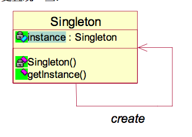

- 本文主要介绍单例设计模式。包括单例的概念、用途、实现方式、如何防止被序列化破坏等。
### 概念
- 单例模式（Singleton Pattern)是Java中最简单的设计模式之一。这种类型的设计模式属于创建型模式。在GOF书中给出的定义为：保证一个类仅有一个实例，并提供一个访问它的全局访问点。
单例模式一般体现在类声明中，单例的类负责创建自己的对象，同时确保只有单个对象被创建。这个类提供了一种访问其唯一的对象的方式，可以直接访问，不需要实例化该类的对象。
### 用途
- 单例模式有以下两个优点：
    - 在内存里只有一个实例，减少了内存的开销，尤其是频繁的创建和销毁实例（比如网站首页页面缓存）。
    - 避免对资源的多重占用（比如写文件操作）。
- 有时候，我们在选择使用单例模式的时候，不仅仅考虑到其带来的优点，还有可能是有些场景就必须要单例。比如类似“一个党只能有一个主席”的情况。
### 实现方式
- 我们知道，一个类的对象的产生是由类构造函数来完成的。如果一个类对外提供了public的构造方法，那么外界就可以任意创建该类的对象。所以，如果想限制对象的产生，一个办法就是将构造函数变为私有的
（至少是受保护的），使外面的类不能通过引用来产生对象。同时为了保证类的可用性，就必须提供一个自己的对象以及访问这个对象的静态方法。
###### 如图

### 饿汉式
- 下面是一个简单的单例的实现： 
```java
//code 1
public class Singleton{
    //在类内部实例化一个实例
    private static Singleton instance = new Singleton();
    //私有的构造函数，外部无法访问
    private Singleton(){
        
    }
    //对外提供获取实例的静态方法
    public static Singleton getInstance(){
        return instance;
    }
}
```
- 使用以下代码测试：
```java
//code2
public class SingletonClient {

    public static void main(String[] args) {
        Singleton singleton = Singleton.getInstance();
        Singleton singleton1 = Singleton.getInstance();
        System.out.println(singleton == singleton1);//输出结果true

    }
}
```
- code1就是一个简单的单例的实现，这种实现方式我们称之为饿汉式。所谓饿汉。这是个比较形象的比喻。对于一个饿汉来说，他希望他想要用到这个实例的时候就能够立即拿到，而不需要任何等待时间。所以，通过
static的静态初始化方式，在该类第一次被加载的时候，就有一个Singleton的实例被创建出来了。这样就保证在第一次想要使用该对象时，他已经被初始化好了。
- 同时，由于该实例在类被加载的时候就创建出来了，所以也就避免了线程安全问题。（原因见：[在深度分析Java的ClassLoader机制（源码级别）](http://www.hollischuang.com/archives/197)、
[Java类的加载、链接和初始化](http://www.hollischuang.com/archives/201)
- 还有一种饿汉模式的变种：
```java
//code3
public class Singleton2 {
    //在类内部定义
    private static Singleton2 instance;

    static {
        //实例化该实例
        instance = new Singleton2();
    }

    //私有的构造函数，外部无法访问
    private Singleton2() {
    }

    //对外提供获取实例的静态方法
    public static Singleton2 getInstance() {
        return instance;
    }
}
```
- code3和code1其实是一样的，都是在类被加载的时候实例化一个对象。
- 饿汉式单例，在类被加载的时候对象就会实例化。这也许会造成不必要的消耗，因为有可能这个实例根本就不会被用到。而且，如果这个类被多次加载的话也会造成多次实例化。其实解决这个问题的方式有很多，
下面提供两种解决方式，第一种是使用静态内部类的形式。第二种是使用懒汉式。
### 静态内部类式
- 先来看通过静态内部类的方式解决上面的问题：
```java
//code 4
public class StaticInnerClassSingleton {
    //在静态内部类中初始化实例对象
    private static class SingletonHolder {
        private static final StaticInnerClassSingleton INSANCE = new StaticInnerClassSingleton();
    }

    //私有的构造方法
    private StaticInnerClassSingleton() {
    }

    //对外提供获取实例的静态方法
    public static final StaticInnerClassSingleton getInstance() {
        return SingletonHolder.INSANCE;
    }
}
```
- 这种方式同样利用了classloader的机制来保证初始化instance时只有一个线程，它跟饿汉式不同的时（很细微的差别）：
    - 饿汉式是只要Singleton类被装载了，那么instance就会被实例化（没有达到lazy loading效果），而这种方式是Singleton类被装载了，instance不一定被初始化。
    因为SingletonHolder没有被主动使用，只有显示通过调用getInstance方法时，才会显示装载SingletonHolder类，从而实例化instance。想象一下，如果实例化instance很消耗资源，
    我想让他延迟加载，另外一方面，我不希望在Singleton类加载时就实例化，因为我不能确保Singleton类还可能在其他的地方被主动使用从而被加载，那么这个时候实例化instance显然是不合适的。
    这个时候，这种方式相比饿汉式更加合理。
### 懒汉式
- 下面看另外一种在该对象真正被使用的时候才会实例化的单例模式- 懒汉模式。
```java
//code5
public class Singleton {
    //定义实例
    private static Singleton instance;

    //私有构造方法
    private Singleton() {
    }

    //对外提供获取实例的静态方法
    public static Singleton getInstance() {
        //在对象被使用的时候才实例化
        if (instance == null) {
            instance = new Singleton();
        }
        return instance;
    }
}
```
- 上面这种单例叫做懒汉式单例。懒汉，就是不会提前把实例创建出来，将类对自己的实例化延迟到第一次被引用的时候。getInstance方法的作用是希望该对象在第一次被使用的时候被new出来。
- 有没有发现，其实code5这种懒汉式单例其实还存在一个问题，那就是线程安全问题。在多线程情况下，有可能两个线程同时进入if语句中，这样，在两个线程都从if中退出的时候就创建了两个不一样的对象。
（这里就不详细讲解了，不理解的请恶补多线程知识）
### 线程安全的懒汉式
- 针对线程不安全的懒汉式的单例，其实解决方式很简单，就是给创建对象的步骤加锁：
```java
//code 6
public class SynchronizedSingleton {
    //定义实例
    private static SynchronizedSingleton instance;

    //私有构造方法
    private SynchronizedSingleton() {
    }

    //对外提供获取实例的静态方法，对该方法加锁
    public static synchronized SynchronizedSingleton getInstance() {
        //在对象被使用的时候才实例化
        if (instance == null) {
            instance = new SynchronizedSingleton();
        }
        return instance;
    }
}
```
- 这种写法能够在多线程中很好的工作，而且看起来它也具备很好的延迟加载，但是，遗憾的是，他效率很低，因为99%情况下不需要同步。
（因为上面的synchronized的加锁范围是整个方法，该方法的所有操作都是同步进行的，但是对于非第一次创建对象的情况，也就是没有进入if语句中的
情况，根本不需要同步操作，可以直接返回instance。）
### 双重校验锁
- 针对上面code 6存在的问题，相信对并发编程了解的同学都知道如何解决。其实上面的代码存在的问题主要是锁的范围太大了。只要缩小锁的范围就可以了。那么如何缩小锁的范围呢？相比于同步方法，
同步代码块的加锁范围更小。code6可以改造成：
```java
//code 7
public class Singleton {
    private static Singleton singleton;

    private Singleton() {
    }
    public static Singleton getSingleton(){
        if(singleton == null)
        {
            synchronized (Singleton.class)
            {
                if(singleton == null)
                {
                    singleton = new Singleton();
                }
            }
        }
        return singleton;
    }
}
```
- code7是对于code6的一种改进写法，通过使用同步代码块的方式减少了锁的范围。这样可以大大提高效率。（对于已经存在singleton的情况，无须同步，直接return）。
- 但是，事情真的有这么容易吗？上面的代码看上去好像是没有任何问题。实现了惰性初始化，解决了同步问题，还减少了锁的范围，提高了效率。但是，该代码还存在隐患。隐患的原因主要和
[Java内存模型（JMM）有关](http://www.hollischuang.com/archives/1003)。考虑下面的事件序列：
    - 线程A发现变量没有被初始化，然后它获取锁并开始变量的初始化。
     由于某些编程语言的语义，编译器生成的代码允许在线程A执行完变量的初始化之前，更新变量并将其指向部分初始化的对象。
     线程B发现共享变量已经被初始化，并返回变量。由于线程B确信变量已被初始化，它没有获取 锁。如果在A完成初始化之前 共享变量对B可见（这是由于A没有完成初始化或者因为一些初始化的值
     还没有穿过B使用的内存（缓存一致性）），程序很可能会崩溃。
 - （上面的例子不太能理解 的同学，请恶补JAVA内存模型相关知识）
 - 在J2SE1.4或更早的版本中使用双重检查锁有潜在的危险，有时会正常工作（区分正确实现和有小问题的实现是很困难的。取决于编译器，线程的调度和其他并发系统活动，不正确的实现双重检查锁导致的异常结果
 - 可能会间歇性出现。重现异常是十分困难的。）在J2SE5.0中，这一问题被修正了。volatile关键字保证多个线程可以正确处理单件实例，
 - 所以针对code7,可以有code8和code9两种替代方案：
 - 1、使用volatile
 ```java
 //code 8
public class VolatileSingleton {
    private static volatile VolatileSingleton singleton;

    private VolatileSingleton() {
    }

    public static VolatileSingleton getSingleton() {
        if (singleton == null) {
            synchronized (VolatileSingleton.class) {
                if (singleton == null) {
                    singleton = new VolatileSingleton();
                }
            }
        }
        return singleton;
    }
}
 ```
 - 上面这种双重校验锁的方式用的比较广泛，他解决了前面提到的所有问题。但是，即使是这种看上去完美无缺的方式也可能存在问题，那就是遇到序列化的时候。详细内容后文介绍。
 - 2、使用final
 ```java
 class FinalWrapper<T> {
    public final T value;

    public FinalWrapper(T value) {
        this.value = value;
    }
}


//code 9
public class FinalSingleton {
    private FinalWrapper<FinalSingleton> helperWrapper = null;

    public FinalSingleton getHelper() {
        FinalWrapper<FinalSingleton> wrapper = helperWrapper;
        if (wrapper == null) {
            synchronized (this) {
                if (helperWrapper == null) {
                    helperWrapper = new FinalWrapper<FinalSingleton>(new FinalSingleton());
                }
                wrapper = helperWrapper;
            }
        }
        return wrapper.value;
    }
}
```
### 枚举式
- 在1.5之前，实现单例一般只有以上几种方法，在1.5之后 ，还有另外一种实现单例的方式，那就是使用枚举：
```java
// code 10
public enum Singleton {

    INSTANCE;

    Singleton() {
    }
}
```
- 这种方式是Effective Java作者Josh Bloch提倡的方式，它不仅能避免多线程同步问题，而且还能防止反序列化重新创建新的对象（下面会介绍），可谓是很很坚强的壁垒阿，在深度分析Java的枚举类型---枚举的线程安全性及序列化问题中有详细介绍枚举的线程
安全问题和序列化问题，不过，个人认为由于1.5中才加入enum特性，用这种方式写不免让人感觉生疏，在实际工作中，我也很少看见有人这么写过，但是不代表他不好。
### 单例与序列化
- 在[单例与序列化的那些事儿](http://www.hollischuang.com/archives/1144)一文中，Hollis就分析过单例和序列化之间的关系-----序列化可以破坏单例。要想防止序列化对单例的破坏，只要Singleton类中定义readResolve就可以解决该问题：
```java

//code 11
import java.io.Serializable;

public class Singleton implements Serializable {
    private volatile static Singleton singleton;

    private Singleton() {
    }

    public static Singleton getSingleton() {
        if (singleton == null) {
            synchronized (Singleton.class) {
                if (singleton == null) {
                    singleton = new Singleton();
                }
            }
        }
        return singleton;
    }

    private Object readResolve() {
        return singleton;
    }
}
```
### 总结
- 本文中介绍了几种实现单例的方法，主要包括饿汉、懒汉、使用静态内部类、双重校验锁、枚举等。还介绍了如何防止序列化破坏类的单例性。
- 从单例的实现中，我们可以发现，一个简单的单例模式就能涉及到这么多知识。在不断完善的过程中可以了解并运用到更多知识。所谓学无止境。
