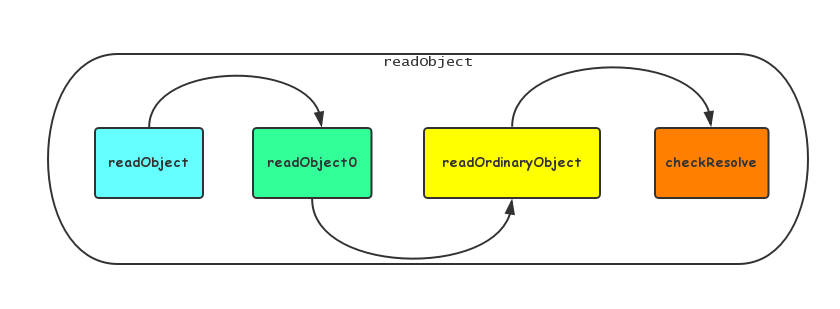
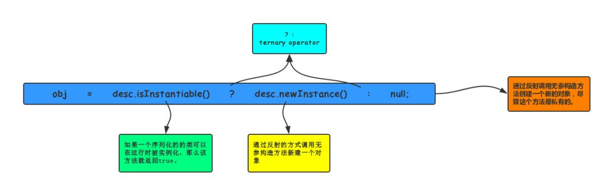

## 单例与序列化的那些事儿
本文将通过实例+阅读Java源码的方式介绍序列化是如何 破坏单例模式的，以及如何避免序列化对单例的破坏。
>单例模式，是设计模式中最简单的一种。通过单例模式可以保证系统中一个类只有一个实例而且该实例易于外界访问，从而
方便对实例个数的控制并节约系统资源。如果希望在系统中某个类的对象只能存在一个，单例模式是最好的解决方案。关于
单例模式的使用方式

但是，单例模式真的能够实现实例的唯一性吗？

答案是否定的，很多人都知道使用反射可以破坏单例模式，除了反射以外，使用序列化与反序列化也同样会破坏单例。

### 序列化对单例的破坏
首先来写一个单例的类：

code1
```java

public class Singleton implements Serializable {
    private volatile static Singleton singleton;

    private Singleton() {
    }

    public static Singleton getSingleton() {
        if (singleton == null) {
            synchronized (Singleton.class) {
                if (singleton == null) {
                    singleton = new Singleton();
                }
            }
        }
        return singleton;
    }
}
```
接下来是一个测试类

code2
```java
public class SerializableDemo1 {
    //为了便于理解，忽略关闭流操作及删除文件操作。真正编码时千万不要忘记
    //Exception直接抛出
    public static void main(String[] args) throws IOException, ClassNotFoundException {
        //Write Obj to file
        ObjectOutputStream oos = new ObjectOutputStream(new FileOutputStream("temFile"));
        oos.writeObject(Singleton.getSingleton());
        //Read Obj from file
        File file= new File("tempFile");
        ObjectInputStream ois = new ObjectInputStream(new FileInputStream(file));

        Singleton newInstance = (Singleton) ois.readObject();
        //判断是否同一个对象  false
        System.out.println(newInstance == Singleton.getSingleton());
    }
}
```
输出结果为false,说明:
>通过对Singleton的序列化与反序列化得到的对象是一个新的对象，这就破坏了Singleton的单例性。

这里，在介绍如何解决这个问题之前，我们先来深入分析一下，为什么会这样？在反序列化的过程中到底发生了什么。
### ObjectInputStream
对象的序列化过程通过ObjectOutputStream和ObjectInputputStream来实现，对么带着刚刚的问题，
分析一下ObjectInputput的readObject方法执行情况到底是怎样的。

为了节省篇幅，这里给出ObjectInputStream的readObject的调用栈：


这里看一下重点代码，`readOrdinaryObject`方法的代码片段：code3
```
private Object readOrdinaryObject(boolean unshared)
        throws IOException
    {
        //此处省略部分代码

        Object obj;
        try {
            obj = desc.isInstantiable() ? desc.newInstance() : null;
        } catch (Exception ex) {
            throw (IOException) new InvalidClassException(
                desc.forClass().getName(),
                "unable to create instance").initCause(ex);
        }

        //此处省略部分代码

        if (obj != null &&
            handles.lookupException(passHandle) == null &&
            desc.hasReadResolveMethod())
        {
            Object rep = desc.invokeReadResolve(obj);
            if (unshared && rep.getClass().isArray()) {
                rep = cloneArray(rep);
            }
            if (rep != obj) {
                handles.setObject(passHandle, obj = rep);
            }
        }

        return obj;
    }
```
code 3中主要贴出两部分代码。先分析第一部分：

code3.1
```
Object obj;
try {
    obj = desc.isInstantiable() ? desc.newInstance() : null;
} catch (Exception ex) {
    throw (IOException) new InvalidClassException(desc.forClass().getName(),"unable to create instance").initCause(ex);
}
```
这里创建的这个obj对象，就是本方法要返回的对象，也可以暂时理解为是ObjectInputStream的readObject返回的对象。



>isInstantiable:如果一个serializable/externalizable的类可以运行时被实例化，那么该方法就返回true。
针对serializable和externalizable我会在其他文章中介绍。

>desc.newInstance：该方法通过反射的方式调用无参构造方法新建一个对象。

所以。到目前为止，也就可以解释，为什么序列化可以破坏单例了？
>答：序列化会通过反射调用无参数的构造方法创建一个新的对象。

那么，接下来我们再看刚开始留下的问题，如何 防止序列化/反序列化破坏单例模式。

### 防止序列化破坏单例模式
***
只要在Singleton类中定义readResolve就可以解决该问题：

code4
```java

public class Singleton防止破坏单例 {
    private volatile static Singleton防止破坏单例 singleton;

    public Singleton防止破坏单例() {
    }

    public static Singleton防止破坏单例 getInstance() {
        if (singleton == null) {
            synchronized (Singleton防止破坏单例.class) {
                if (singleton == null) {
                    singleton = new Singleton防止破坏单例();
                }
            }
        }
        return singleton;
    }

    private Object readResolve() {
        return singleton;
    }
}
```
还是运行以下测试类
```java
public class SerializableDemo2 {
    //为了便于理解，忽略关闭流操作及删除文件操作。真正编码时千万不要忘记
    //Exception直接抛出
    public static void main(String[] args) throws IOException, ClassNotFoundException {
        //Write Obj to file
        ObjectOutputStream oos = new ObjectOutputStream(new FileOutputStream("temFile"));
        oos.writeObject(Singleton防止破坏单例.getInstance());
        //Read Obj from file
        File file= new File("tempFile");
        ObjectInputStream ois = new ObjectInputStream(new FileInputStream(file));

        Singleton防止破坏单例 newInstance = (Singleton防止破坏单例) ois.readObject();
        //判断是否同一个对象  false
        System.out.println(newInstance == Singleton防止破坏单例.getInstance());
    }
}
```
本次输出结果为true。具体原理，我们回过头继续分析code3中的第二段代码：

code3.2
```

if (obj != null &&
            handles.lookupException(passHandle) == null &&
            desc.hasReadResolveMethod())
        {
            Object rep = desc.invokeReadResolve(obj);
            if (unshared && rep.getClass().isArray()) {
                rep = cloneArray(rep);
            }
            if (rep != obj) {
                handles.setObject(passHandle, obj = rep);
            }
        }
```
`hasReadResolveMethod`：如果实现了serializable或者externalizable接口的类中包含`readResolve`
则返回true

`invokeReadResolve`:通过反射的方式调用要被反序列化的类的readResolve方法。

所以，原理也就清楚了，主要在Singleton中定义readResolve方法，并在该方法中指定要返回的对象的生成策略，
就可以防止单例被破坏。
## 总结
在涉及到序列化的场景时，要格外 注意他对单例的破坏。